# Learning_RabbitMQ

# 🐰 Sistema de Relatórios com RabbitMQ e PostgreSQL

## 📋 Visão Geral

Este projeto demonstra uma implementação completa de **Event-Driven Architecture** utilizando .NET 8, RabbitMQ, PostgreSQL e MassTransit. O sistema processa solicitações de relatórios de forma assíncrona, ilustrando conceitos fundamentais de mensageria e arquitetura orientada a eventos.

## 🏗️ Arquitetura do Sistema

### Diagrama de Arquitetura

```mermaid
graph TB
    subgraph "Cliente"
        A[Aplicação Cliente]
    end
    
    subgraph "API Layer"
        B[ASP.NET Core API]
        C[Controllers/Endpoints]
    end
    
    subgraph "Business Layer"
        D[RelatorioService]
        E[IPublishBus]
    end
    
    subgraph "Message Broker"
        F[RabbitMQ]
        G[Exchange Fanout]
        H[Queue]
    end
    
    subgraph "Data Layer"
        I[RelatorioRepository]
        J[Entity Framework]
        K[PostgreSQL]
    end
    
    subgraph "Background Processing"
        L[Event Consumer]
    end
    
    A --> B
    B --> C
    C --> D
    D --> E
    D --> I
    E --> F
    F --> G
    G --> H
    H --> L
    L --> I
    I --> J
    J --> K
```


### Componentes Principais

| Componente | Responsabilidade | Tecnologia |
|------------|------------------|------------|
| **API REST** | Interface HTTP para solicitações | ASP.NET Core |
| **Service Layer** | Lógica de negócio e orquestração | C# Services |
| **Message Broker** | Comunicação assíncrona | RabbitMQ + MassTransit |
| **Repository** | Abstração de acesso a dados | Entity Framework Core |
| **Database** | Persistência de dados | PostgreSQL |
| **Background Worker** | Processamento assíncrono | Event Consumer |

## 🔄 Fluxo Detalhado de Dados

### 📤 Fluxo de Solicitação (POST)

```mermaid
sequenceDiagram
    participant C as Cliente
    participant API as API Endpoint
    participant S as RelatorioService
    participant DB as PostgreSQL
    participant PUB as PublishBus
    participant RMQ as RabbitMQ
    participant CONS as Consumer
    
    C->>API: POST /api/relatorios/solicitar/{nome}
    API->>S: SolicitarRelatorioAsync(nome)
    S->>DB: Salvar nova solicitação (status: "Pendente")
    DB-->>S: Retorna entidade criada
    S->>PUB: PublishAsync(RelatorioSolicitadoEvent)
    PUB->>RMQ: Enviar mensagem para fila
    S-->>API: Retorna SolicitacaoRelatorio
    API-->>C: HTTP 201 Created + dados da solicitação
    
    Note over RMQ: Mensagem aguarda processamento
    
    RMQ->>CONS: Entrega mensagem
    CONS->>S: ProcessarRelatorioAsync(id, nome)
    S->>DB: Atualizar status para "Completado"
    DB-->>S: Confirmação
    S-->>CONS: Processamento concluído
```



### 📥 Fluxo de Consulta (GET)

```mermaid
sequenceDiagram
    participant C as Cliente
    participant API as API Endpoint
    participant S as RelatorioService
    participant R as Repository
    participant DB as PostgreSQL
    
    C->>API: GET /api/relatorios
    API->>S: ObterTodosRelatoriosAsync()
    S->>R: ObterTodosAsync()
    R->>DB: SELECT * FROM solicitacoes_relatorio
    DB-->>R: Resultados ordenados
    R-->>S: Lista de relatórios
    S-->>API: Lista completa
    API-->>C: HTTP 200 OK + dados
```



## 🛠️ Tecnologias e Frameworks

### Stack Principal
- **.NET 8**: Framework base
- **ASP.NET Core**: Web API
- **Entity Framework Core**: ORM
- **PostgreSQL**: Banco de dados relacional
- **RabbitMQ**: Message broker
- **MassTransit**: Abstração para RabbitMQ
- **Docker**: Containerização dos serviços

### Pacotes NuGet
```xml
<PackageReference Include="Microsoft.EntityFrameworkCore" Version="8.0.0" />
<PackageReference Include="Microsoft.EntityFrameworkCore.Design" Version="8.0.0" />
<PackageReference Include="Npgsql.EntityFrameworkCore.PostgreSQL" Version="8.0.0" />
<PackageReference Include="Microsoft.EntityFrameworkCore.Tools" Version="8.0.0" />
<PackageReference Include="MassTransit" Version="8.0.0" />
<PackageReference Include="MassTransit.RabbitMQ" Version="8.0.0" />
```

## 📁 Estrutura Detalhada do Projeto

```
RabbitMQ/
├── 📂 Bus/                                    # Camada de Mensageria
│   ├── IPublishBus.cs                        # Interface para publicação
│   ├── PublishBus.cs                         # Implementação do publisher
│   └── RelatorioSolicitadoEventConsumer.cs   # Consumer de eventos
├── 📂 Controllers/                           # Camada de Apresentação
│   ├── ApiEndpoints.cs                       # Endpoints REST
│   └── 📂 Relatorios/
│       └── RelatorioSolicitadoEvent.cs       # Evento de domínio
├── 📂 Data/                                  # Camada de Dados
│   ├── ApplicationDbContext.cs               # Contexto EF Core
│   ├── 📂 Entities/
│   │   └── SolicitacaoRelatorio.cs          # Entidade de banco
│   └── 📂 Repositories/
│       └── RelatorioRepository.cs            # Repository pattern
├── 📂 Services/                              # Camada de Negócio
│   └── RelatorioService.cs                   # Lógica de negócio
├── 📂 Extension/                             # Configurações
│   └── AppExtensions.cs                      # DI e setup
├── 📂 Properties/
│   └── launchSettings.json                   # Config desenvolvimento
├── Program.cs                                # Ponto de entrada
├── appsettings.json                          # Configurações
└── docker-compose.yml                        # Orquestração containers
```

## 🚀 Configuração e Execução

### Pré-requisitos
- **.NET 8 SDK**
- **Docker** e **Docker Compose**
- **Visual Studio** ou **VS Code**

### 1. Clonar e Preparar
```bash
git clone <repository-url>
cd RabbitMQ
dotnet restore
```

### 2. Subir Infraestrutura
```bash
# Subir PostgreSQL e RabbitMQ
docker-compose up -d

# Verificar se serviços estão rodando
docker-compose ps
```

### 3. Configurar Banco de Dados
```bash
# Criar migration inicial
dotnet ef migrations add InitialCreate

# Aplicar migration
dotnet ef database update
```

### 4. Executar Aplicação
```bash
dotnet run
```

### 5. Acessar Interfaces
- **API**: https://localhost:7042
- **Swagger**: https://localhost:7042/swagger
- **RabbitMQ Management**: http://localhost:15672 (guest/guest)
- **PostgreSQL**: localhost:5432 (postgres/postgres123)

## 🔌 API Reference

### 📤 POST `/api/relatorios/solicitar/{nome}`
Cria uma nova solicitação de relatório.

**Request:**
```bash
curl -X POST "https://localhost:7042/api/relatorios/solicitar/vendas-2024" \
     -H "Content-Type: application/json"
```

**Response (201 Created):**
```json
{
  "id": "550e8400-e29b-41d4-a716-446655440000",
  "nome": "vendas-2024",
  "status": "Pendente",
  "dataCriacao": "2025-08-19T14:30:00Z",
  "dataProcessamento": null,
  "observacoes": null
}
```

### 📥 GET `/api/relatorios`
Lista todas as solicitações de relatório.

**Request:**
```bash
curl -X GET "https://localhost:7042/api/relatorios"
```

**Response (200 OK):**
```json
[
  {
    "id": "550e8400-e29b-41d4-a716-446655440000",
    "nome": "vendas-2024",
    "status": "Completado",
    "dataCriacao": "2025-08-19T14:30:00Z",
    "dataProcessamento": "2025-08-19T14:30:05Z",
    "observacoes": "Processamento concluído com sucesso"
  }
]
```

### 🔍 GET `/api/relatorios/{id}`
Obtém relatório específico por ID.

**Request:**
```bash
curl -X GET "https://localhost:7042/api/relatorios/550e8400-e29b-41d4-a716-446655440000"
```

## 🎯 Event-Driven Architecture

### Conceitos Implementados

#### 1. **Publisher-Subscriber Pattern**
- **Publisher**: API endpoints que publicam eventos
- **Subscriber**: Consumers que processam eventos
- **Desacoplamento**: Componentes não se conhecem diretamente

#### 2. **Event Sourcing**
- Eventos representam mudanças de estado
- Histórico completo de ações no sistema
- Reprocessamento possível através dos eventos

#### 3. **CQRS (Command Query Responsibility Segregation)**
- **Commands**: POST (alteram estado)
- **Queries**: GET (apenas leitura)
- Otimização independente de leitura/escrita

#### 4. **Saga Pattern (Preparado)**
- Transações distribuídas através de eventos
- Compensação automática em caso de falhas
- Coordenação de processos longos

## 📊 Análise: Benefícios vs Malefícios

### ✅ **Benefícios da Programação Orientada a Eventos**

#### **Desacoplamento**
- **Baixo acoplamento**: Componentes independentes
- **Alta coesão**: Cada módulo tem responsabilidade específica
- **Flexibilidade**: Fácil adição de novos consumers
- **Manutenibilidade**: Mudanças isoladas não afetam outros componentes

#### **Escalabilidade**
- **Horizontal**: Múltiplos consumers processando em paralelo
- **Vertical**: Aumento de recursos por componente
- **Load Balancing**: Distribuição automática de carga
- **Elasticidade**: Adição/remoção dinâmica de workers

#### **Resiliência**
- **Fault Tolerance**: Falha em um componente não derruba o sistema
- **Retry Automático**: MassTransit reprocessa mensagens falhas
- **Dead Letter Queue**: Mensagens problemáticas isoladas
- **Circuit Breaker**: Proteção contra cascata de falhas

#### **Performance**
- **Processamento Assíncrono**: Resposta imediata ao usuário
- **Throughput Alto**: Processamento em paralelo
- **Otimização Independente**: Cada componente pode ser otimizado separadamente
- **Cache Eficiente**: Dados podem ser cacheados por camada

#### **Observabilidade**
- **Rastreamento**: Cada evento pode ser logado
- **Métricas**: Throughput, latência, erros por componente
- **Debugging**: Fácil identificação de problemas
- **Auditoria**: Histórico completo de eventos

### ❌ **Malefícios e Desafios**

#### **Complexidade**
- **Curva de Aprendizado**: Conceitos avançados de arquitetura
- **Debugging Complexo**: Fluxo distribuído entre componentes
- **Configuração**: Múltiplos serviços para configurar
- **Overhead de Desenvolvimento**: Mais código boilerplate

#### **Consistência Eventual**
- **Eventual Consistency**: Dados podem estar temporariamente inconsistentes
- **Race Conditions**: Ordem de processamento não garantida
- **Sincronização**: Dificuldade em manter estado consistente
- **Transações Distribuídas**: Complexidade adicional

#### **Infraestrutura**
- **Dependências Externas**: RabbitMQ, PostgreSQL
- **Monitoramento**: Necessário monitorar múltiplos componentes
- **Deployment**: Orquestração de múltiplos serviços
- **Costs**: Infraestrutura adicional

#### **Latência de Rede**
- **Network Hops**: Múltiplas chamadas de rede
- **Serialização**: Overhead de JSON
- **Message Broker**: Latência adicional
- **Database Round-trips**: Múltiplas queries

## 🐰 RabbitMQ - Análise Detalhada

### ✅ **Vantagens do RabbitMQ**

#### **Confiabilidade**
- **Durabilidade**: Mensagens persistem em disco
- **Acknowledgments**: Confirmação de processamento
- **Clustering**: Alta disponibilidade
- **Backup/Recovery**: Recuperação de dados

#### **Flexibilidade**
- **Múltiplos Patterns**: pub/sub, request/reply, routing
- **Exchange Types**: Direct, Topic, Fanout, Headers
- **Binding Dinâmico**: Roteamento configurável
- **Plugins**: Extensibilidade através de plugins

#### **Performance**
- **Throughput Alto**: Milhares de mensagens/segundo
- **Low Latency**: Latência sub-milissegundo
- **Memory Management**: Gerenciamento eficiente de memória
- **Flow Control**: Controle automático de fluxo

#### **Ecossistema**
- **Multi-Language**: Suporte a várias linguagens
- **Management UI**: Interface gráfica completa
- **Monitoring**: Métricas detalhadas
- **Community**: Grande comunidade e documentação

### ❌ **Desvantagens do RabbitMQ**

#### **Complexidade Operacional**
- **Configuração**: Múltiplas opções podem confundir
- **Tuning**: Otimização requer conhecimento específico
- **Troubleshooting**: Debugging pode ser complexo
- **Learning Curve**: Conceitos AMQP não triviais

#### **Limitações Técnicas**
- **Single Point of Failure**: Sem clustering adequado
- **Memory Usage**: Pode consumir muita memória
- **Disk I/O**: Performance dependente do disco
- **Network Partitions**: Problemas em falhas de rede

#### **Overhead**
- **Infraestrutura**: Servidor adicional para manter
- **Latência**: Hop adicional na comunicação
- **Serialização**: Overhead de conversão JSON
- **Monitoring**: Necessário monitorar separadamente

## 📈 Mensageria - Benefícios vs Desafios

### ✅ **Benefícios da Mensageria**

#### **Integração**

```mermaid
graph LR
    A[Serviço A] --> M[Message Broker]
    B[Serviço B] --> M
    C[Serviço C] --> M
    M --> D[Serviço D]
    M --> E[Serviço E]
    M --> F[Serviço F]
```


- **Loose Coupling**: Serviços independentes
- **Protocol Independence**: Diferentes protocolos
- **Language Agnostic**: Diferentes linguagens
- **Legacy Integration**: Integração com sistemas antigos

#### **Escalabilidade Horizontal**
- **Load Distribution**: Carga distribuída automaticamente
- **Consumer Scaling**: Adicionar consumers conforme demanda
- **Geographic Distribution**: Consumers em diferentes regiões
- **Resource Optimization**: Recursos alocados dinamicamente

#### **Reliability Patterns**
- **At-Least-Once Delivery**: Garantia de entrega
- **Retry Mechanisms**: Reprocessamento automático
- **Dead Letter Queues**: Isolamento de mensagens problemáticas
- **Circuit Breakers**: Proteção contra falhas

### ❌ **Desafios da Mensageria**

#### **Consistência de Dados**
- **Eventual Consistency**: Estado eventualmente consistente
- **Duplicate Messages**: Possibilidade de mensagens duplicadas
- **Out-of-Order Processing**: Ordem não garantida
- **Lost Messages**: Risco de perda em falhas

#### **Complexidade de Debug**
- **Distributed Tracing**: Rastreamento através de múltiplos serviços
- **Log Correlation**: Correlação de logs distribuídos
- **Error Handling**: Tratamento de erros complexo
- **Testing**: Testes de integração complexos

#### **Operational Overhead**
- **Infrastructure**: Múltiplos componentes para manter
- **Monitoring**: Monitoramento de cada componente
- **Deployment**: Orquestração complexa
- **Security**: Segurança em múltiplas camadas

## 🎨 Patterns de Design Implementados

### 1. **Repository Pattern**
```csharp
// Abstração da persistência
public interface IRelatorioRepository
{
    Task<SolicitacaoRelatorio> CriarAsync(SolicitacaoRelatorio solicitacao);
    // ... outros métodos
}
```
**Benefícios**: Testabilidade, mudança de ORM, abstração

### 2. **Dependency Injection**
```csharp
// Inversão de controle
services.AddScoped<IRelatorioService, RelatorioService>();
```
**Benefícios**: Testabilidade, flexibilidade, desacoplamento

### 3. **Command Query Separation**
- **Commands**: POST endpoints (alteram estado)
- **Queries**: GET endpoints (apenas leitura)

### 4. **Event-Driven Communication**
```csharp
// Publicação de evento
await _publishBus.PublishAsync(new RelatorioSolicitadoEvent(id, nome));
```

### 5. **Async/Await Pattern**
```csharp
// Operações não-bloqueantes
public async Task<SolicitacaoRelatorio> CriarAsync(SolicitacaoRelatorio solicitacao)
```

## 💾 Schema do Banco de Dados

### Tabela: `solicitacoes_relatorio`

| Coluna | Tipo | Constraints | Descrição |
|--------|------|-------------|-----------|
| `id` | UUID | PRIMARY KEY, DEFAULT gen_random_uuid() | Identificador único |
| `nome` | VARCHAR(200) | NOT NULL | Nome do relatório |
| `status` | VARCHAR(50) | NOT NULL | Status atual |
| `data_criacao` | TIMESTAMP | DEFAULT CURRENT_TIMESTAMP | Data de criação |
| `data_processamento` | TIMESTAMP | NULL | Data de conclusão |
| `observacoes` | VARCHAR(500) | NULL | Observações adicionais |

### Índices Criados
```sql
-- Performance em consultas por status
CREATE INDEX ix_solicitacoes_relatorio_status ON solicitacoes_relatorio(status);

-- Performance em consultas por data
CREATE INDEX ix_solicitacoes_relatorio_data_criacao ON solicitacoes_relatorio(data_criacao);
```

## 📊 Monitoramento e Observabilidade

### Logs Estruturados
```csharp
_logger.LogInformation(
    "Relatório solicitado: {Id} - {Nome}", 
    solicitacaoId, 
    nomeRelatorio
);
```

### Métricas Importantes
- **Throughput**: Mensagens/segundo processadas
- **Latência**: Tempo entre solicitação e conclusão
- **Error Rate**: Taxa de erros por componente
- **Queue Depth**: Tamanho das filas RabbitMQ

### Dashboards Recomendados
- **RabbitMQ Management**: Filas, exchanges, connections
- **Application Logs**: Structured logging com Serilog
- **Database Metrics**: Connection pool, query performance
- **Custom Metrics**: Business metrics específicos

## 🔧 Configurações Avançadas

### Connection String com Pool
```json
{
  "ConnectionStrings": {
    "DefaultConnection": "Host=localhost;Port=5432;Database=relatorios_db;Username=postgres;Password=postgres123;Pooling=true;MinPoolSize=5;MaxPoolSize=100;ConnectionLifeTime=300"
  }
}
```

### RabbitMQ com Retry Policy
```csharp
busConfigurator.UsingRabbitMq((ctx, cfg) =>
{
    cfg.Host(new Uri("amqp://localhost:5672"), host =>
    {
        host.Username("guest");
        host.Password("guest");
    });
    
    cfg.UseMessageRetry(retry => retry.Exponential(
        retryLimit: 3,
        minInterval: TimeSpan.FromSeconds(1),
        maxInterval: TimeSpan.FromMinutes(5),
        intervalDelta: TimeSpan.FromSeconds(2)
    ));
    
    cfg.ConfigureEndpoints(ctx);
});
```

## 🧪 Testando o Sistema

### Teste de Carga
```bash
# Criar múltiplas solicitações
for i in {1..10}; do
  curl -X POST "https://localhost:7042/api/relatorios/solicitar/teste-$i"
done

# Verificar processamento
curl -X GET "https://localhost:7042/api/relatorios"
```

### Validação no Banco
```sql
-- Conectar ao PostgreSQL
docker exec -it rabbitmq_postgres_1 psql -U postgres -d relatorios_db

-- Verificar dados
SELECT nome, status, data_criacao, data_processamento 
FROM solicitacoes_relatorio 
ORDER BY data_criacao DESC;

-- Estatísticas por status
SELECT status, COUNT(*), 
       AVG(EXTRACT(EPOCH FROM (data_processamento - data_criacao))) as avg_processing_time_seconds
FROM solicitacoes_relatorio 
WHERE data_processamento IS NOT NULL
GROUP BY status;
```

## 🔮 Roadmap de Melhorias

### Curto Prazo
- [ ] **Retry Policies**: Implementar políticas de retry
- [ ] **Dead Letter Queue**: Isolar mensagens com erro
- [ ] **Health Checks**: Monitoramento de saúde dos serviços
- [ ] **Validation**: FluentValidation para requests
- [ ] **Exception Handling**: Global exception handler

### Médio Prazo
- [ ] **Authentication**: JWT + Identity
- [ ] **Authorization**: Políticas de acesso
- [ ] **Rate Limiting**: Controle de taxa de requisições
- [ ] **Caching**: Redis para cache distribuído
- [ ] **Background Jobs**: Hangfire para jobs programados

### Longo Prazo
- [ ] **Microservices**: Separar em múltiplos serviços
- [ ] **Event Store**: Event sourcing completo
- [ ] **CQRS Read Models**: Views otimizadas
- [ ] **Distributed Tracing**: OpenTelemetry
- [ ] **Message Versioning**: Versionamento de eventos

## 🏆 Melhores Práticas Implementadas

### **Domain-Driven Design**
- Eventos representam conceitos de domínio
- Linguagem ubíqua nos nomes
- Bounded contexts bem definidos

### **Clean Architecture**
- Separação de responsabilidades
- Dependency inversion
- Infrastructure isolada

### **Twelve-Factor App**
- Configuration via environment
- Stateless processes
- Port binding configurável

### **Observability**
- Structured logging
- Correlation IDs
- Health checks preparados

## 🔒 Considerações de Segurança

### Implementadas
- **Input Validation**: Validação de entrada
- **SQL Injection Protection**: Entity Framework parametrizado
- **HTTPS**: Comunicação criptografada

### A Implementar
- **Authentication**: JWT tokens
- **Authorization**: Role-based access
- **Message Encryption**: Criptografia de mensagens
- **Audit Trail**: Log de todas as ações

## 📚 Recursos de Aprendizado

### Documentação Oficial
- [MassTransit Documentation](https://masstransit-project.com/)
- [RabbitMQ Tutorials](https://www.rabbitmq.com/tutorials/)
- [Entity Framework Core](https://docs.microsoft.com/ef/core/)
- [PostgreSQL Documentation](https://www.postgresql.org/docs/)

### Conceitos Avançados
- **Event Sourcing**: Martin Fowler
- **CQRS**: Greg Young
- **Microservices Patterns**: Chris Richardson
- **Building Event-Driven Microservices**: Adam Bellemare

## 🤝 Contribuindo

1. Fork o projeto
2. Crie feature branch (`git checkout -b feature/nova-funcionalidade`)
3. Commit mudanças (`git commit -m 'Adiciona nova funcionalidade'`)
4. Push para branch (`git push origin feature/nova-funcionalidade`)
5. Abra Pull Request

### Padrões de Commit
```
feat: adiciona nova funcionalidade
fix: corrige bug específico
docs: atualiza documentação
style: formatação de código
refactor: refatoração sem mudança de comportamento
test: adiciona ou atualiza testes
chore: tarefas de manutenção
```

## 📞 Troubleshooting

### Problemas Comuns

#### RabbitMQ não conecta
```bash
# Verificar se está rodando
docker ps | grep rabbitmq

# Logs do container
docker logs rabbitmq_rabbitmq_1
```

#### PostgreSQL connection failed
```bash
# Verificar conexão
docker exec -it rabbitmq_postgres_1 pg_isready

# Logs do PostgreSQL
docker logs rabbitmq_postgres_1
```

#### Migrations falham
```bash
# Reset migrations
dotnet ef database drop
dotnet ef migrations remove
dotnet ef migrations add InitialCreate
dotnet ef database update
```

#### Mensagens não são processadas
1. Verificar se consumer está registrado
2. Confirmar conexão RabbitMQ
3. Checar logs do consumer
4. Verificar Management UI (http://localhost:15672)

### Logs Úteis
```bash
# Logs da aplicação
dotnet run --verbosity detailed

# Logs específicos EF Core
export ASPNETCORE_ENVIRONMENT=Development
```

## 📄 Licença

Este projeto é desenvolvido para fins educacionais e demonstração de conceitos de arquitetura de software.

---

**🎯 Este projeto demonstra uma implementação robusta e profissional de Event-Driven Architecture, servindo como base sólida para sistemas distribuídos modernos.**
